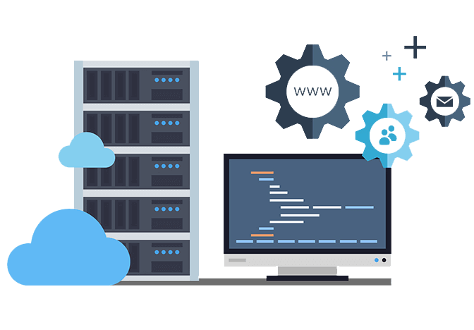

<h1 align="center">🚀 Haque's Portfolio - API Server (Backend)</h1>

<div align="center">
  
</div>

<p align="center">
  This repository contains the backend source code for my personal portfolio. It is a robust RESTful API built with Node.js, Express, and MongoDB, responsible for authentication, data management, and powering the dynamic features of the frontend.
</p>

<p align="center">
  <a href="https://portfolio-backend-gold-chi.vercel.app" target="_blank">
    <strong>🌐 View Live API URL</strong>
  </a>
</p>

<p align="center">
  
  
  
  
</p>

---

## ✨ Key Features

* **🛡️ Secure JWT Authentication**:
    * Owner-only login system with JSON Web Tokens (JWT).
    * Passwords are securely hashed using `bcryptjs`.
    * A seed script is included to create the initial admin user.

* **✍️ RESTful APIs for Content Management**:
    * Full CRUD (Create, Read, Update, Delete) endpoints for `Blogs` and `Projects`.
    * Data models are defined and managed using `Mongoose` schemas.

* **🔐 Protected Routes**:
    * Custom middleware (`authMiddleware`) is used to protect admin-only endpoints (POST, PUT, DELETE), ensuring only authenticated users can modify content.

* **🔄 On-Demand Revalidation Trigger**:
    * After any content is created, updated, or deleted, the backend sends a secure webhook request to the Next.js frontend's revalidation API.
    * This instantly purges the frontend's static cache, ensuring that public pages always show the most up-to-date information.

* ** modern ES Module Architecture**:
    * The entire backend is built using modern ES Module (`import`/`export`) syntax, configured with `tsx` for an excellent development experience.

---

## 🛠️ Technology Stack

* **Runtime**: [Node.js](https://nodejs.org/)
* **Framework**: [Express.js](https://expressjs.com/)
* **Database**: [MongoDB](https://www.mongodb.com/) (with [MongoDB Atlas](https://www.mongodb.com/cloud/atlas) for hosting)
* **ODM**: [Mongoose](https://mongoosejs.com/)
* **Authentication**: [JSON Web Tokens (JWT)](https://jwt.io/), [bcrypt.js](https://github.com/dcodeIO/bcrypt.js)
* **Development**: [TypeScript](https://www.typescriptlang.org/), [tsx](https://github.com/esbuild-kit/tsx) for live-reloading

---

## 📋 API Endpoints

| Method | Endpoint             | Access  | Description                      |
| :----- | :------------------- | :------ | :------------------------------- |
| `POST` | `/api/auth/login`    | Public  | Log in the admin user.           |
| `GET`  | `/api/blogs`         | Public  | Get all blog posts.              |
| `GET`  | `/api/blogs/:id`     | Public  | Get a single blog post.          |
| `POST` | `/api/blogs`         | Private | Create a new blog post.          |
| `PUT`  | `/api/blogs/:id`     | Private | Update a blog post.              |
| `DELETE`|`/api/blogs/:id`     | Private | Delete a blog post.              |
| `GET`  | `/api/projects`      | Public  | Get all projects.                |
| `POST` | `/api/projects`      | Private | Create a new project.            |
| `PUT`  | `/api/projects/:id`  | Private | Update a project.                |
| `DELETE`|`/api/projects/:id`  | Private | Delete a project.                |

---

## ⚙️ Environment Variables

To run this project locally, create a `.env` file in the root directory and add the following variables:
```
# Your MongoDB Atlas connection string
DATABASE_URL="mongodb+srv://..."

# A long, random, and secret string for signing JWTs
JWT_SECRET="your_super_secret_jwt_string"

# The port for the server to run on
PORT=5000

# The base URL of your frontend application (for sending revalidation webhooks)
FRONTEND_URL="http://localhost:3000"

# A secret token to secure the revalidation API route.
# This must be identical to the token in the frontend's .env file.
REVALIDATION_TOKEN="your_super_secret_token"
```

---

## 🚀 Getting Started

1.  **Clone the repository:**
    ```bash
    git clone (https://github.com/maksudulhaque2000/Assignment-7-L2-backend)
    cd portfolio-backend
    ```

2.  **Install dependencies:**
    ```bash
    npm install
    ```

3.  **Set up environment variables:**
    * Create a `.env` file and add the variables as described above.

4.  **Seed the database:**
    * This command will create the initial admin user (`admin@example.com`, `password123`).
    ```bash
    npm run seed
    ```

5.  **Run the development server:**
    ```bash
    npm run dev
    ```

The server will start on `http://localhost:5000`.

---

## 🔑 Admin Credentials for Testing

To access the private dashboard for managing blogs and projects, please use the following credentials on the login page.

| Role  | Email                 | Password      |
| :---- | :-------------------- | :------------ |
| Admin | `admin@example.com`   | `password123` |

**Login Page URL:** `[YOUR_LIVE_DEMO_URL]/login`

---

## 📂 Project Structure
- The backend is a RESTful API built with Node.js and Express, following a modular structure to separate concerns and ensure maintainability.

portfolio-backend-mongo/
├── 📁 src/
│   ├── 📁 config/
│   │   └── db.ts                  # 🔌 Logic for connecting to the MongoDB database
│   ├── 📁 middleware/
│   │   └── authMiddleware.ts      # 🛡️ JWT middleware to protect admin-only routes
│   ├── 📁 models/
│   │   ├── blogModel.ts           # Mongoose schema and model for Blogs
│   │   ├── projectModel.ts        # Mongoose schema and model for Projects
│   │   └── userModel.ts           # Mongoose schema and model for Users (Admin)
│   ├── 📁 routes/
│   │   ├── authRoutes.ts          # API routes for authentication (e.g., /login)
│   │   ├── blogRoutes.ts          # API routes for all blog-related CRUD operations
│   │   └── projectRoutes.ts       # API routes for all project-related CRUD operations
│   ├── index.ts                   # 🚀 Main server entry point (Express app setup & middleware)
│   └── seed.ts                    # 🌱 Script to seed the database with an initial admin user
├── vercel.json                    # Vercel deployment configuration
└── ...                            # Root configuration files (.env, package.json, tsconfig.json, etc.)

---

## 📬 Let's Connect

If you like my work or want to discuss a project, feel free to contact me:

* **Email**: [smmaksudulhaque2000@gmail.com](mailto:smmaksudulhaque2000@gmail.com)
* **LinkedIn**: [linkedin.com/in/maksudulhaque2000](https://www.linkedin.com/in/maksudulhaque2000/)
* **GitHub**: [github.com/maksudulhaque2000](https://github.com/maksudulhaque2000)
* **Facebook**: [facebook.com/maksudulhaque2000](https://www.facebook.com/maksudulhaque2000)
* **YouTube**: [youtube.com/@maksudulhaque2000](https://www.youtube.com/@maksudulhaque2000)

---

## 📜 License

This project is licensed under the [MAKSUDUL HAQUE](HAQUE). Feel free to use this project to create your own portfolio!

---